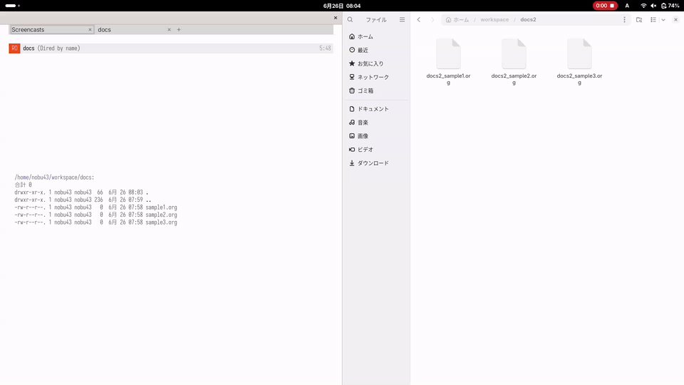
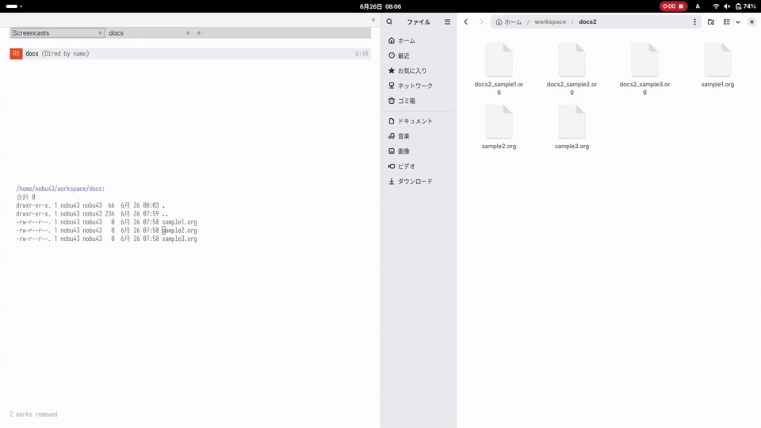
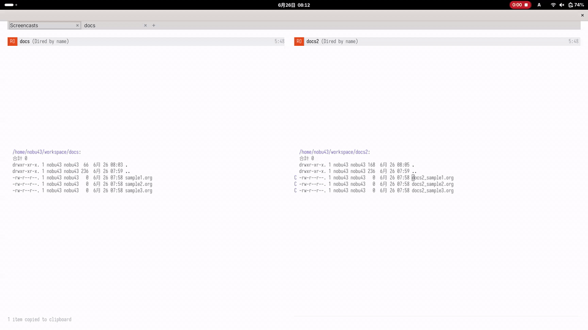

#+title: dired-clipboard

~dired-clipboard~ adds file-oriented copy and paste commands to Dired.

It lets you use familiar clipboard keys in Dired:

- ~M-w~ copies marked files and directories, or the file at point when no
  files are marked.
- ~C-w~ cuts marked files and directories, or the file at point when no
  files are marked.
- ~C-y~ pastes files and directories from the clipboard into the current Dired
  directory.
- ~M-w~ and ~C-w~ keep their normal behavior while the region is active.
- ~M-w~, ~C-w~ and ~C-y~ keep their normal editing behavior in WDired.

The package also tries to interoperate with desktop file managers by using
native file clipboard formats where practical.

* Demo

* Requirements

- Emacs 30.1 or later
- Optional: ~wl-copy~ for better file clipboard interoperability on
  PGTK/Wayland
- Optional: PowerShell on Windows for Explorer FileDrop clipboard support
- Optional: ~osascript~ on macOS for Finder pasteboard support

* Installation

Put ~dired-clipboard.el~ somewhere in your ~load-path~, then enable the minor
mode in Dired buffers:

#+begin_src emacs-lisp
  (add-to-list 'load-path "/path/to/dired-clipboard.el")
  (require 'dired-clipboard)

  (add-hook 'dired-mode-hook #'dired-clipboard-mode)
#+end_src

With ~use-package~:

#+begin_src emacs-lisp
  (use-package dired-clipboard
    :load-path "/path/to/dired-clipboard.el"
    :hook (dired-mode . dired-clipboard-mode))
#+end_src

* Usage

In a Dired buffer:

- Mark one or more files, then press ~M-w~ to copy them.
- Mark one or more files, then press ~C-w~ to cut them.
- Press ~M-w~ on an unmarked file to copy the file at point.
- Press ~C-w~ on an unmarked file to cut the file at point.
- Open another Dired directory and press ~C-y~ to copy the clipboard files
  there, or move them there after ~C-w~.

When the clipboard contains files copied from a supported desktop file manager,
~C-y~ can paste those files into the current Dired directory.

* Desktop Clipboard Support

~dired-clipboard~ supports these clipboard formats:

- Plain newline-separated file names for Dired-to-Dired copy and paste
- Dired-to-Dired cut and paste through ~C-w~ and ~C-y~
- ~text/uri-list~
- ~x-special/gnome-copied-files~ with copy/cut operations
- ~x-special/mate-copied-files~ with copy/cut operations
- Windows Explorer FileDrop, through PowerShell/.NET
- macOS Finder file URLs, through ~osascript~ and AppleScriptObjC

OS/environment-specific file clipboard support is implemented as ordered
backends.  Built-in backends are tried only when their capabilities are
available:

- ~windows~ for Explorer FileDrop on Windows, including copy/move
  ~Preferred DropEffect~ metadata
- ~macos~ for Finder/NSPasteboard file URLs on macOS
- ~wayland~ for ~wl-copy~ file MIME data on PGTK/Wayland, including
  GNOME/Nautilus and MATE/Caja MIME targets where detected

On PGTK/Wayland, Emacs may not advertise the file clipboard MIME types expected
by desktop file managers.  When ~wl-copy~ is available,
~dired-clipboard-copy~ can use it to own the clipboard with file clipboard data.

* Customization

- ~dired-clipboard-recursive-copies~ controls how directory copies are handled.
- ~dired-clipboard-keep-marker~ controls the marker used for pasted files.
- ~dired-clipboard-existing-file-policy~ controls how paste handles existing
  destination files.
- ~dired-clipboard-use-wl-copy~ enables or disables ~wl-copy~ integration.
- ~dired-clipboard-wayland-target~ selects the Wayland file clipboard MIME
  target.
- ~dired-clipboard-use-native-file-clipboard~ enables or disables native
  Windows and macOS file clipboard integration.
- ~dired-clipboard-file-clipboard-backends~ controls the backend order.
- ~dired-clipboard-file-clipboard-backend-alist~ can be extended with custom
  environment-specific backends.
- ~dired-clipboard-powershell-program~ selects the PowerShell executable.
- ~dired-clipboard-osascript-program~ selects the ~osascript~ executable.

* Limitations

** TRAMP and remote desktops

The main target is local files that Emacs can access directly.  For predictable
behavior, use this package for local Dired buffers and local desktop file
managers.

TRAMP files and remote desktop file clipboard sharing are not general-purpose
file transfer mechanisms.  In remote desktop sessions, copied file paths often
refer to the remote desktop filesystem rather than the filesystem visible to the
Emacs process.  ~dired-clipboard~ therefore treats remote desktop integration as
best-effort and does not try to provide transparent remote file transfer.

** Windows

On Windows, Explorer cut/copy state is represented with ~Preferred DropEffect~,
so Explorer-to-Dired and Dired-to-Explorer move operations can work when the
target application honors that clipboard metadata.

** macOS

On macOS the pasteboard has no source-side cut/move flag, unlike Windows
Explorer's ~Preferred DropEffect~ or the GNOME/MATE copy/cut markers.  This
package records the chosen operation in a private pasteboard type, so
Dired-to-Dired ~C-w~ followed by ~C-y~ still moves the files.

Other applications, including Finder, cannot see that private marker, and macOS
offers no way for the *source* of a clipboard to request a move.  On macOS the
copy-vs-move decision for a paste is made by the *receiver* at paste time, not
by the source when the files were marked.  macOS users should expect this:

- Pasting Emacs-clipboard files into Finder with ~Cmd-V~ always *copies* them,
  whether you used ~M-w~ or ~C-w~ in Dired.
- To *move* them into a Finder folder, use Finder's own ~Option-Cmd-V~
  ("Move Items Here").  It moves whatever files are on the clipboard and works
  because the files are present as file URLs; it does not depend on, and is not
  affected by, the Dired cut marker.

* License

GPL-3.0-or-later.  See [[file:LICENSE][LICENSE]].
